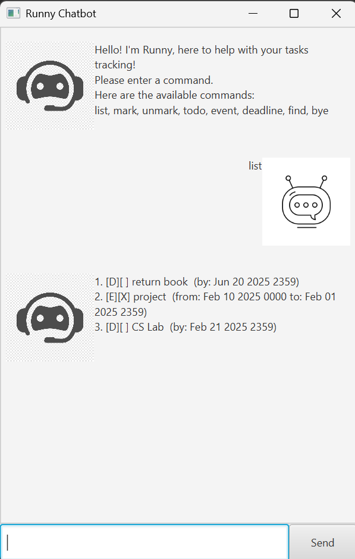

# Runny User Guide

# Runny Chatbot

Runny Chatbot is a chatbot capable of storing and tracking user tasks. Runny Chatbot is optimized for use via a **Command Line Interface** (CLI) while retaining the benefits of a **Graphical User Interface** (GUI). Let Runny Chatbot assist you with your tasks!!

 

## Quick start
1. Ensure you have Java `17` or above installed on your computer.

1. Download the latest `runny.jar` from [here](https://github.com/TanJieHaoAmos/ip/releases).

1. Save the file to a folder that you want to use as the _main folder_ for Runny Chatbot.

1. Open a command terminal, `cd` into the folder to which you downloaded the jar file, and run the `java -jar runny.jar` command to run the application. 
   A GUI similar to the one below should appear in a few seconds. **Please note that your version will be a fresh copy and only the welcome message will be displayed.**   
   

1. Refer to the [Features](#features) below for details of each command.

## Features 
### Adding Todos

Create a 'todo' task using the description given.

Format: `todo [DESC]`

Examples:
* `todo buy book` will create a todo task with the description of `buy book`
  
### Adding Deadlines

Create a 'deadline' task with the description and date given.

Format: `deadline [DESC] /by [YYYY-MM-DD HHMM]`

* if time HHMM is not given, it will default to 2359 hours.

Examples:
* `deadline return book /by 2025-02-15 1200` will create a deadline task with the description of `buy book` with the date by `2025-02-15 1200`

### Adding Events

Create an 'event` task with the description and date given.

Format: `event [DESC] /from [YYYY-MM-DD HHMM] /to [YYYY-MM-DD HHMM]`

* if time HHMM is not given in `/from`, it will default to 0000 hours.
* if time HHMM is not given in `/to`, it will default to 2359 hours.

Examples:
* `event book sale /from 2025-02-20 1200 /to 2025-02-20 1600` will create an event task with the description of `book sale` with the date from `2025-02-20 1200` to `2025-02-20 1600`

### Listing all tasks: `list`

Shows a list of all tasks in the list.

Format: `list`

### Deleting a task: `delete`

Deletes the specified task from the list.

Format: `delete [INDEX]`

* Deletes the task at the specified `INDEX`
* The index refers to the index number shown in the displayed task list.
* The index **must be a positive integer**

### Marking a task: `mark`

Marks the specified task from the list as done.

Format: `mark [INDEX]`

* Marks the task at the specified `INDEX`
* The index refers to the index number shown in the displayed task list.
* The index **must be a positive integer**

### Unmarking a task: `unmark`

Unmarks the specified task from the list as not done.

Format: `unmark [INDEX]`

* Unmarks the task at the specified `INDEX`
* The index refers to the index number shown in the displayed task list.
* The index **must be a positive integer**

### Finding some tasks: `find`

Finds all tasks in the list containing the given keywords.

Format: `find [KEYWORD]`

* The search is case-sensitive. e.g `book` will match `book`
* The order of the keywords does matter. e.g. `sell book` will not match `book sell`
* Only the description is searched.

Example:
* `find books` will return tasks containing the `books` keyword.

### Undoing a command: `undo`

Undoes a previous valid command.

Format: `undo`

* The undo will only undo the previous valid command.
* Consecutive use of undo will undo all the previous valid commands until there are no commands left to be undone
* The undo command cannot be undone.

### Exiting the program: `bye`

Quits and closes the program.

Format: `bye`

### Take note
Runny Chatbot saves the data to a local file automatically. That local file will be located in data/duke.txt, inside the folder where you save runny.jar. There is no need for you, the user, to save data manually.
